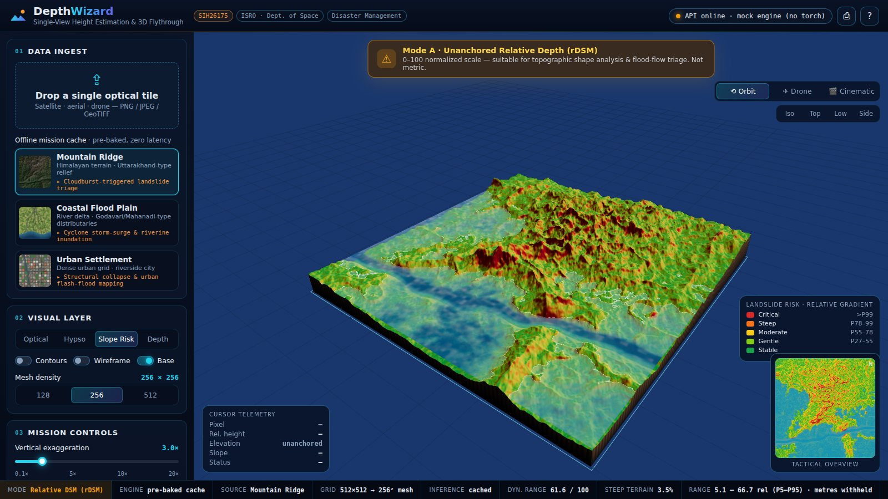
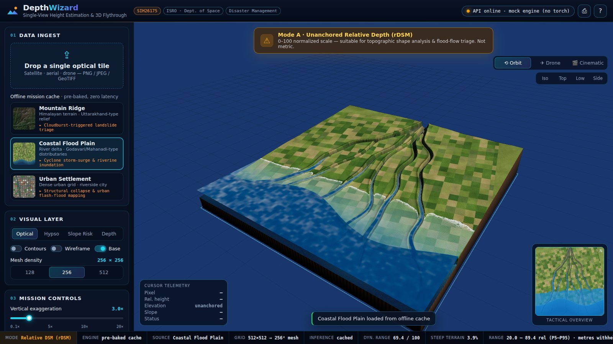
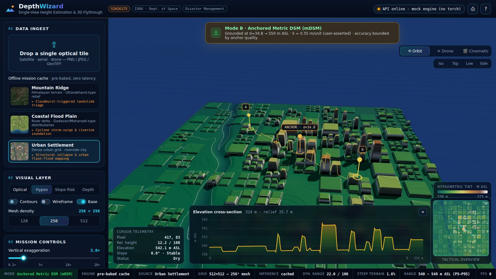
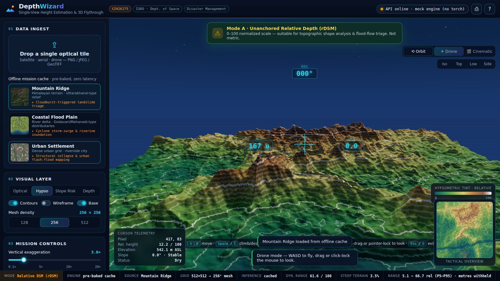
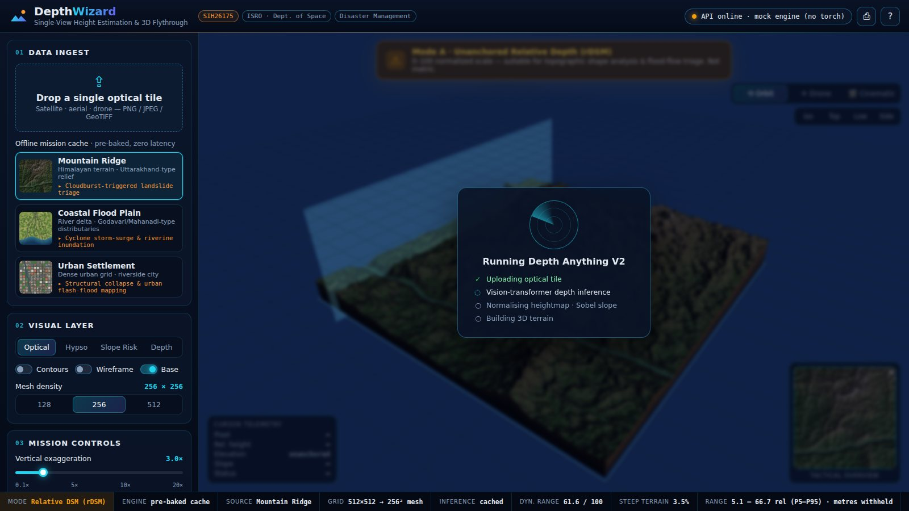

# DepthWizard — Single-View Height Estimation & 3D Flythrough

> **Smart India Hackathon · SIH26175** · Indian Space Research Organisation (ISRO) / Department of Space
> Theme: Disaster Management · Space Technology · Software Edition

During a flash flood, cloudburst, landslide or structural collapse, responders rarely get a Cartosat stereo pair or
a LiDAR pass — they get **one** optical image. DepthWizard turns that single satellite tile, aerial photo or drone
frame into a continuous height map and an **interactive 3D mission workstation** for triage: fly the terrain, raise
the water, see where the slopes will fail.



| Coastal storm-surge simulation | Anchored metric DSM + cross-section |
|---|---|
|  |  |
| **First-person drone flight** | **Live inference** |
|  |  |

---

## Why DepthWizard is different

Single-view depth is **mathematically ill-posed**: a monocular network recovers *shape*, not *metric scale*.
Most tools render a bumpy plane and quietly print metres. DepthWizard is built around that constraint.

### 1. Fail-closed elevation — rDSM vs mDSM
* **Mode A · Relative DSM (rDSM)** — the default for any uncalibrated upload. A persistent amber banner reads
  *"Unanchored Relative Depth (0–100 Normalized Scale) — suitable for topographic shape analysis and flood-flow
  triage."* Every readout, histogram, profile and export stays in relative units. Metres are **withheld**.
* **Mode B · Anchored Metric DSM (mDSM)** — click any point with a known elevation (runway, gauge station,
  coastline = 0 m) and the entire map is grounded:

  $$Z_{\text{metric}}(x,y) = Z_{\text{anchor}} + \big(d(x,y) - d_{\text{anchor}}\big) \times S$$

  **S** (metres per relative unit) can be entered, or **solved automatically from a second known point**:
  $S = (Z_2 - Z_a)/(d_2 - d_a)$, with guards for degenerate or contradictory references. The banner turns green
  and states exactly what the grounding rests on.

### 2. Slope & landslide-risk view
Sobel gradient $\sqrt{\Delta x^2 + \Delta y^2}$ of the heightmap rendered as a green → red hazard ramp.
* In rDSM it ranks slopes by gradient percentile (honest: relative steepness only).
* Once anchored **and** a ground-sample distance is known, it switches to **real slope angles** with
  susceptibility classes (<15° stable · 15–25° gentle · 25–35° moderate · 35–45° steep · >45° critical), and the
  cursor reports slope in degrees.

### 3. Flood simulator that reports numbers, not just visuals
A physically placed water plane with a depth-aware shader (shallow/deep colour, shoreline foam, animated ripples)
rises with a slider or an animated **surge**. Live readouts: inundated fraction, **flooded area** (from GSD) and
**stored water volume** (only once anchored — fail-closed again), plus a height histogram showing what is under
water.

---

## Feature list

| Area | Capability |
|---|---|
| Ingest | Drag-and-drop PNG / JPEG / **GeoTIFF** (16-bit, multi-band, georeferenced → pixel size auto-fills GSD) |
| Inference | `depth-anything/Depth-Anything-V2-Small-hf` zero-shot relative depth, CPU or CUDA, percentile-robust 8-bit normalisation |
| Resilience | Offline cache of 3 pre-baked scenarios · backend mock engine (`--mock`) · browser-side fallback if the API is unreachable — the demo never dies |
| 3D engine | `PlaneGeometry(100,100,256,256)` + `displacementMap`, baked normal maps, PCF soft shadows, ACES tone mapping, strata base, adjustable sun, 128/256/512 mesh density |
| Cameras | Orbit (Iso/Top/Low/Side presets) · **WASD drone** with mouse-look, banking, terrain-following, AGL/speed/heading HUD · **cinematic** auto-flythrough |
| Layers | Optical · Hypsometric tint · Slope risk · Raw depth · Contours · Wireframe |
| Analysis | Cursor telemetry (height, elevation, slope, submerged depth) · A→B **elevation cross-section** with water line · tactical minimap (click to jump) |
| Export | Screenshot PNG · heightmap PNG · JSON triage report (mode, anchor, flood stats, caveats) |

---

## Quick start

### 1. Backend (FastAPI, Python 3.10+)
```bash
cd backend
python -m venv .venv && source .venv/bin/activate      # Windows: .venv\Scripts\activate
pip install -r requirements-ml.txt                       # torch + transformers for the real model
uvicorn app:app --reload --port 8000
```
The first request downloads Depth Anything V2-Small (~100 MB) from Hugging Face.
No GPU / no torch? `pip install -r requirements.txt` and the service starts in **mock mode** automatically, or force
it with `python app.py --mock` / `DEPTHWIZARD_MOCK=1 uvicorn app:app`.

### 2. Frontend (Vite + Three.js, Node 18+)
```bash
cd frontend
npm install
npm run dev            # http://localhost:5173  (/api is proxied to :8000)
```

### Single-port demo build
```bash
cd frontend && npm run build        # produces frontend/dist
cd ../backend && uvicorn app:app --port 8000
# open http://localhost:8000 — FastAPI serves the workstation and the API together
```

---

## Architecture

```
Browser (Vite + Three.js)                         FastAPI service (backend/)
┌─────────────────────────────────┐   POST      ┌───────────────────────────────────────┐
│ Upload tile / pick cached sample │ ─────────▶  │ decode PNG/JPEG/GeoTIFF → RGB          │
│                                 │ /api/       │ Depth Anything V2-Small (or mock)      │
│ HeightField (CPU)               │ generate-   │ robust 0–255 normalisation             │
│  · bilinear sampling, Sobel     │ depth       │ Sobel slope → hazard ramp              │
│  · hypso / slope / normal maps  │ ◀─────────  │ inundation mask, stats, histogram      │
│  · contours, flood area/volume  │  JSON+PNG   └───────────────────────────────────────┘
│ Engine (WebGL)                  │
│  · displaced terrain + skirt    │
│  · flood shader, sky, shadows   │
│ Flight: orbit / drone / cinema  │
│ HUD: minimap, profile, legend   │
└─────────────────────────────────┘
```

```
backend/
  app.py              FastAPI app, routes, GeoTIFF IO, static hosting of frontend/dist
  depth_engine.py     Depth Anything V2 wrapper + procedural mock engine
  analytics.py        normalisation, Sobel slope, hazard ramp, stats, inundation mask
  tests/              pytest suite (API contract, GeoTIFF, analytics)
frontend/
  src/engine.js       Three.js scene, terrain, heightfield ray-marching picker
  src/water.js        depth-aware flood shader
  src/flight.js       orbit / drone / cinematic camera controller
  src/heightfield.js  CPU heightfield: sampling, slope, stats, texture layers
  src/hud.js          minimap, histogram, cross-section chart, legends
  src/main.js         UI wiring, anchor tool, fail-closed logic, exports
  public/samples/     offline cache: textures, depth maps, manifest
scripts/
  generate_samples.py  procedural satellite-style scenarios with exact heights
  evaluate_samples.py  scale/shift-aligned accuracy metrics vs ground truth
docs/                  problem statement, screenshots, evaluation output
```

### API
`POST /api/generate-depth` — multipart `file` (PNG/JPEG/TIFF, ≤ 40 MB)

```jsonc
{
  "depth_image": "<base64 PNG, 8-bit single channel>",
  "slope_image": "<base64 PNG, hazard colour ramp>",
  "inundation_mask": "<base64 PNG>", "inundation_level": 41,
  "texture_image": "<base64 PNG, only for TIFF input>",
  "min_val": 0, "max_val": 255, "width": 1024, "height": 768,
  "engine": "depth-anything-v2-small", "device": "cuda", "mock": false,
  "inference_ms": 212.4, "mode": "rDSM",
  "geo": { "georeferenced": true, "pixel_size": [5.0, 5.0], "bounds": [...] },
  "stats": { "relative_dynamic_range": 63.1, "steep_fraction": 0.041, "low_lying_fraction": 0.2, "histogram": [...] }
}
```
`GET /api/health` — engine name, device, mock flag.

---

## Controls

| Key | Action | Key | Action |
|---|---|---|---|
| `1`–`4` | Optical / Hypso / Slope risk / Depth | `[` `]` | Lower / raise flood plane |
| `O` `F` `C` | Orbit / Drone / Cinematic | `+` `−` | Vertical exaggeration |
| `R` `T` | Reset iso view / top-down | `K` | Contours |
| `W A S D` | Drone move · `Space`/`C` climb/descend · `Shift` boost | `P` | Screenshot |
| mouse wheel | Drone cruise speed | `H` | Field manual |

---

## Offline samples & validation

`frontend/public/samples/` ships three scenarios generated by `scripts/generate_samples.py`:

| Scenario | Stand-in for | Demo story |
|---|---|---|
| **Mountain Ridge** | Himalayan relief, Uttarakhand-type | Cloudburst → landslide triage with the slope-risk view |
| **Coastal Flood Plain** | Godavari/Mahanadi-type delta | Cyclone storm surge → run the surge simulator |
| **Urban Settlement** | Dense riverside city | Anchor on the "airport runway = 550 m" and profile across blocks |

They are *synthetic* satellite-style renders of procedural terrain, which means their heightmaps are **exact ground
truth**. That makes the offline demo fully deterministic and gives a built-in accuracy check:

```bash
python scripts/evaluate_samples.py          # Depth Anything V2 vs ground truth
python scripts/evaluate_samples.py --mock   # baseline
```
Metrics use the standard scale-and-shift alignment for relative depth (Pearson, Spearman, aligned RMSE on the
0–100 scale, and IoU of steep-slope pixels). The mock-engine baseline is in `docs/evaluation_mock-procedural.json`.
Real-world validation against CartoDEM / Cartosat-1 stereo DSMs is the natural next step.

---

## Suggested 3-minute judge walkthrough

1. **Mountain Ridge** loads on start → press `C` for the cinematic flythrough.
2. Press `3` (**Slope risk**) → point out the fail-closed banner: gradients are *relative* percentiles.
3. **Coastal Flood Plain** → *Simulate surge* → watch inundated % and area climb; hover to read submerged depth.
4. **Urban Settlement** → click the scenario reference (*Airport runway = 550 m*), click the terrain, **Apply** →
   banner turns green, readouts switch to m ASL, volume unlocks. Draw an A→B profile across the blocks.
5. Press `F` and fly the drone low through the streets. Export the JSON triage report.
6. Drop in any image from the audience to show live inference.

## Limitations & roadmap
* Relative depth from a nadir view mixes terrain with canopy/buildings (a DSM, not a DTM).
* The metric scale is only as good as the anchor(s); multi-anchor least-squares fitting and CartoDEM priors would
  tighten it.
* Next: Bhuvan/Cartosat tile ingestion, GeoTIFF/COG export of the anchored DSM, D8 flow-accumulation for drainage
  paths, and fine-tuning on Indian terrain with CartoDEM supervision.

---
Full problem statement: [`docs/PROBLEM_STATEMENT.md`](docs/PROBLEM_STATEMENT.md)
